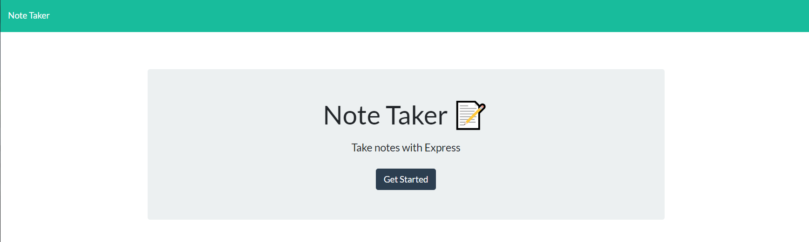

# Taking Notes

## Heroku Deployment

https://gentle-forest-75537.herokuapp.com/

## Working Process

Currently the website itself is running but I need to work on actually getting the db.json file to be read and displayed on the page.
I need to read over the json file initially and then make an array with all of the current posts to be able to push a new post into.
Once that is done I can write a new array onto the json file for displaying all current notes..

